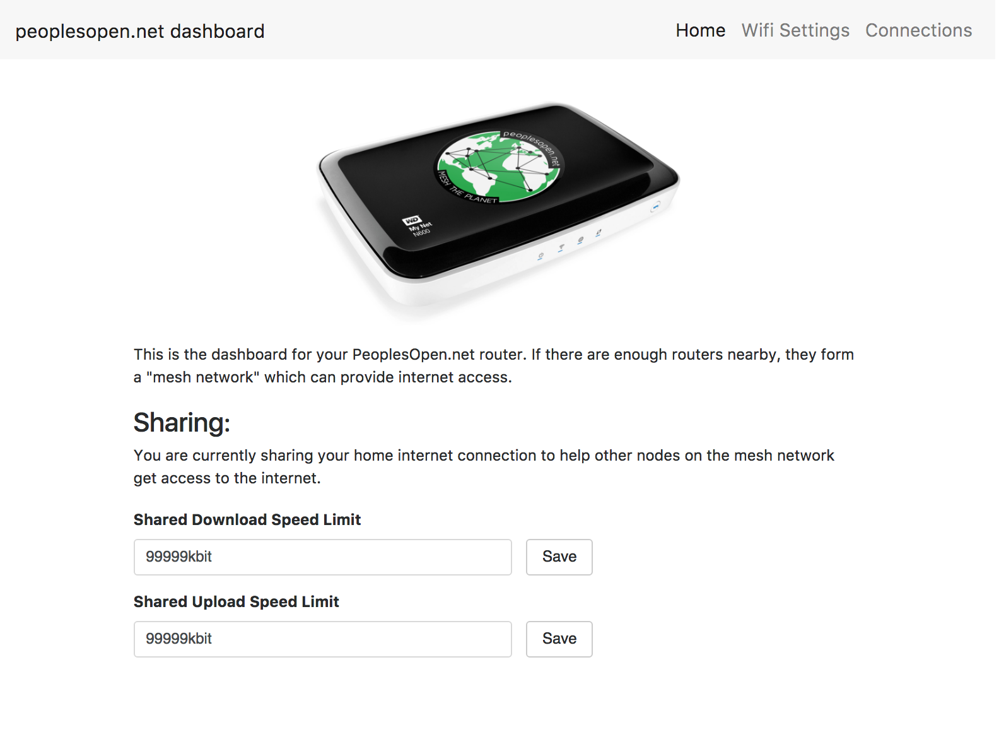
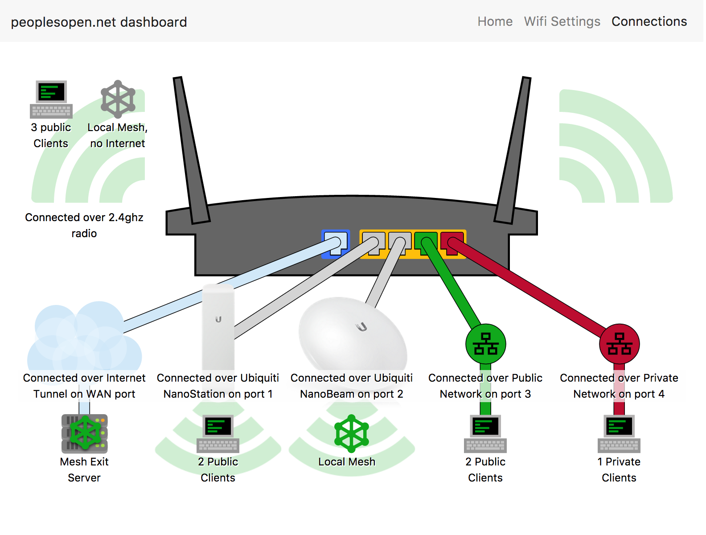
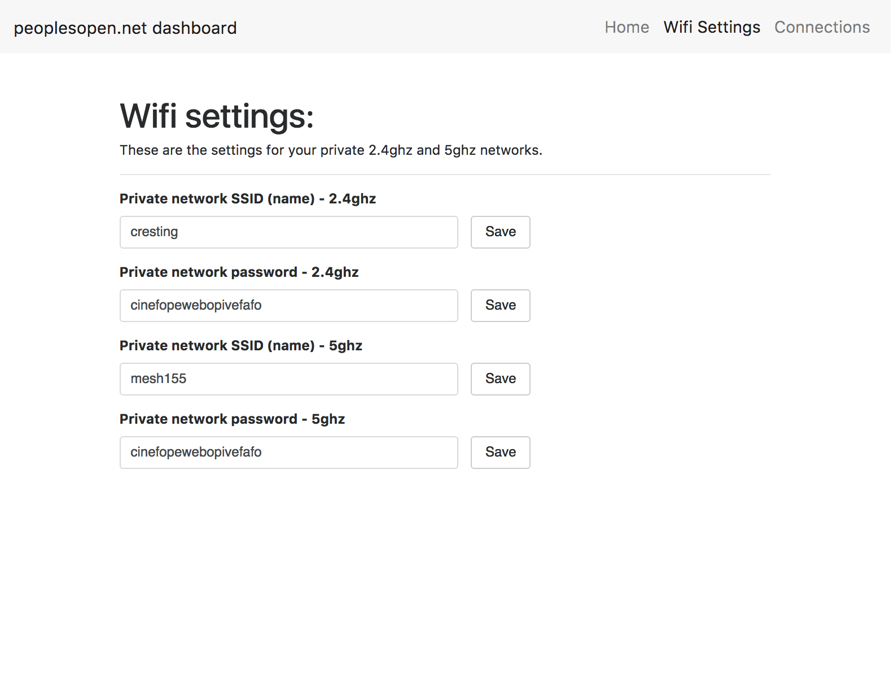

# PeoplesOpen.net dashboard

This is the welcome page and dashboard for PeoplesOpen.net home node owners. People can use this web app to check in on and configure their home nodes.

The __Home__ page lets you set how much bandwidth you want to share on your public wifi network.

The __Wifi Settings__ page lets you set the name and password for your private wifi network.

The __Connections__ page shows you what computers are currently connected to your public and private networks. It also shows you if your node is connected to an exitnode (TODO: link to exitnode documentation).

## Development

This web app runs on home nodes. It uses OpenWRT's [ubus](https://openwrt.org/docs/techref/ubus) interface to write to config files on the node. It also uses a script in `/cgi-bin` to gather information about the node.

### Getting started

1) Clone the repo

2) `npm install` the dependencies

### Developing without a node

Run `npm build-dev` to build the web app in "development" mode. This configures the app to use stubbed API responses so that you can develop on your local machine (instead of on a home node).

Run `npm start` to start serving the app.

#### Writing new API calls

When adding a new ubus API call to the app (woo! you rock!), be sure to add a stubbed reply. This allows people to continue developing without having a home node on-hand.

Stubbed replies live in [`src/actions/stubs/`](src/actions/stubs/), and they are imported and used by [`src/actions/ubusAPI.js`](src/actions/ubusAPI.js).

### Testing with a node

This is important if you are adding new pages that interface with ubus or cgi-bin.

1) Acquire a home node (see [the walkthrough](https://sudoroom.org/wiki/Mesh/WalkThrough))

2) Connect to your home node's private network, either via the private SSID or by plugging directly into the private ethernet port

3) Run `./publish-to-node.sh`. This will build the app in production mode (i.e. stop using stubbed API replies) and copy the build directory to your node's `www/` folder. It will ask for confirmation. You may want to `ssh` in and backup the existing `www/` directory before doing this.

4) Visit `http://172.30.0.1` and voila! Now you can test the real calls to ubus.

### Developing with and without a node (kind of hacky)

If you want to serve the web app from your computer, but still point the app to a real home node, you can do this by disabling your browser's CORS checks.

First, `npm build-prod` to build the app for production.

Now run `npm start`, but this time open Chrome with the [--disable-web-security and --user-data-dir](http://stackoverflow.com/questions/3102819/disable-same-origin-policy-in-chrome) flags. You should be able to log into the control panel (you'll need the admin password of course) at localhost:3000 and see it live-update as you edit the code.

__NOTE:__ "Developing with and without a node" does not reflect the real environment in which the app will be running (notably, your browser is running with non-standard security settings). Your ultimate test should involve copying the build/ directory over to your node as described above in "Testing with a node".

## Application architecture

This is meant to be a pretty typical React-Redux application. You should be able to read about all the concepts used in the documentation for these libraries:

- [Redux](http://redux.js.org)
- [React](https://facebook.github.io/react/)
- [Redux-thunk](https://github.com/gaearon/redux-thunk)

## Screenshots

----

----

